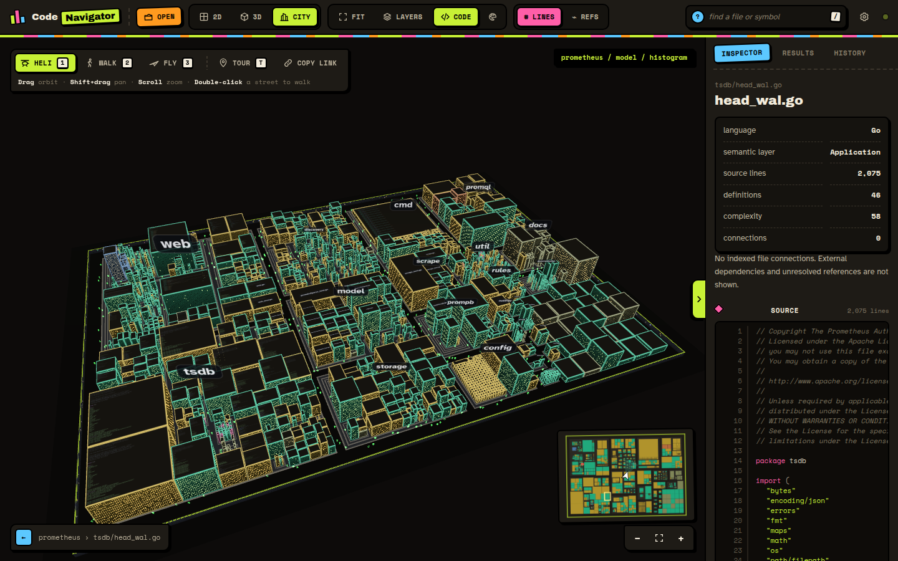
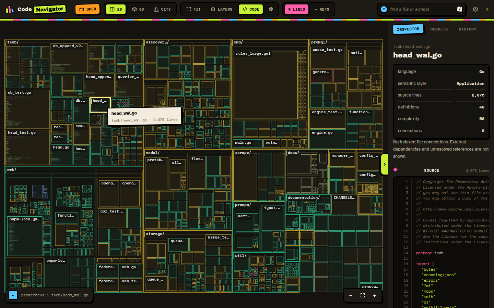
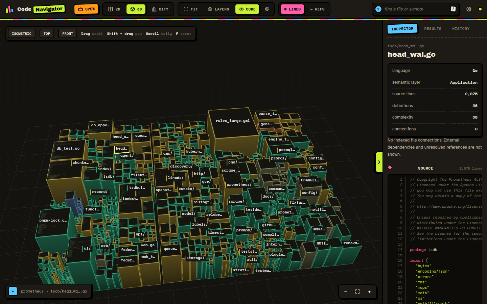
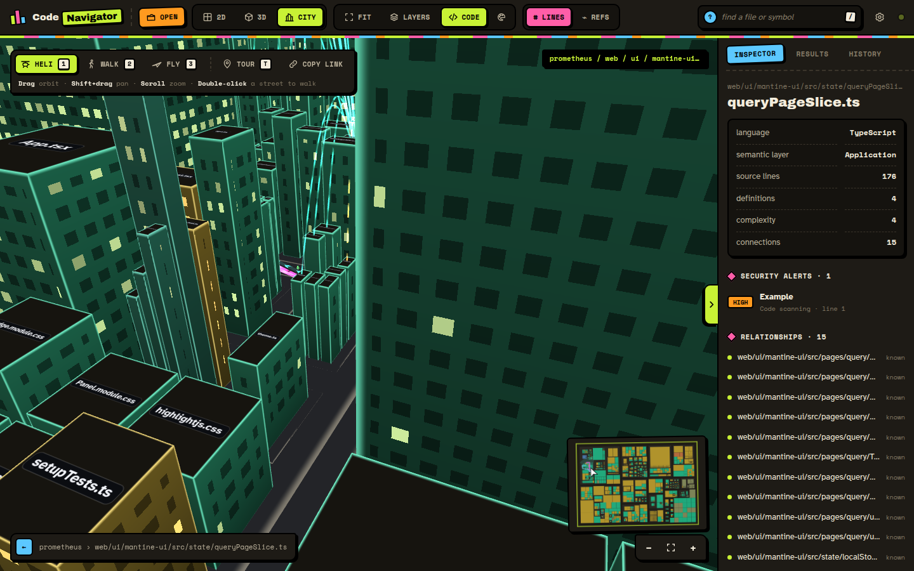
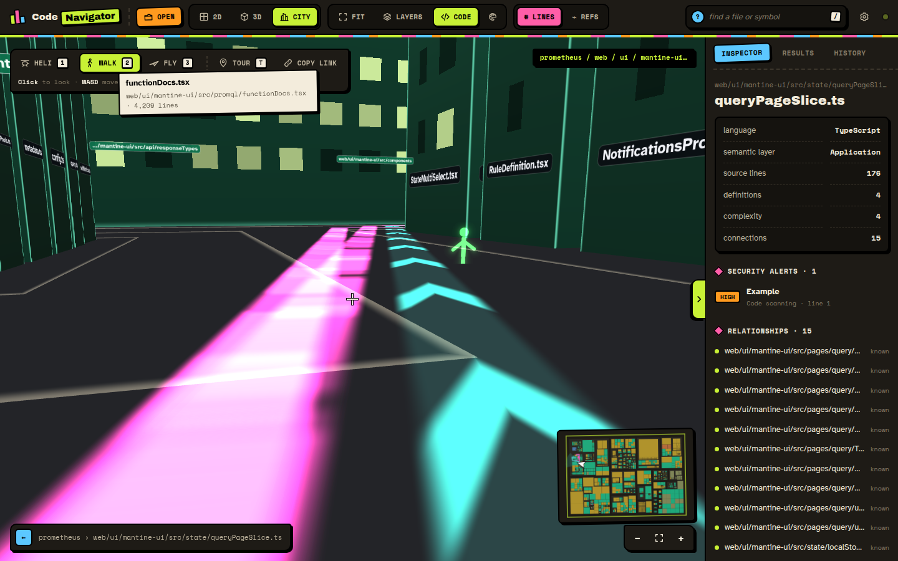

# CodeNavigator

**See your code as a city.** CodeNavigator indexes a GitHub repository (or, if you allow it, a local
folder) and turns it into a place you can explore: a zoomable map, a 3D landscape, and a walkable
night-time city where every file is a building and every folder is a street.



It's a single Go binary with no dependencies beyond the standard library. It serves both the
indexing API and the browser frontend (plain ES modules and WebGL2, no build step).

## What you can do

| | |
|---|---|
|  | **2D map**: a squarified treemap of every file, sized by lines or references, with source code rendered right on the tiles as you zoom in. |
|  | **3D landscape**: the same map extruded, orbit, pan and dolly around it. |
|  | **City**: folders become districts and blocks, files become buildings (footprint from lines, height from complexity, lit windows from definitions). Select a file to see its imports as cyan routes and its dependents as pulsing magenta routes along the streets. |
|  | **Walk and fly** at street level with signs on every wall, folder street signs on the corners, source code on the facade in front of you, wandering residents and a city wall covered in posters. |

Also:

- **Search** every file and symbol, with results raised as light beacons in the city.
- **Private GitHub repos** via a GitHub App sign-in, scoped to the visitor's own access.
- **Security alerts**: with the right GitHub permissions, files with open code scanning or
  Dependabot alerts smoke, burn (critical/high) and get wrapped in hazard tape.
- **Multi-user**: every browser gets its own private sessions, snapshots and sign-in.
- **Guided tour** of the biggest districts, and **shareable links** to an exact spot.
- **Touch controls**: joystick, look and pinch.

## Quick start

```bash
go run .                                  # http://127.0.0.1:4177
```

Open the page, click **Open a codebase**, and paste a public GitHub URL such as
`https://github.com/prometheus/prometheus`. `git` must be on your `PATH` for cloning.

With Docker:

```bash
./build.sh                                # builds codenavigator:latest, running the tests inside
docker run --rm -p 4177:4177 codenavigator:latest
```

## Configuration

| Variable | Default | Purpose |
|---|---|---|
| `PORT` | `4177` | Listening port (`--port` overrides) |
| `CORS_ORIGIN` | `*` | `Access-Control-Allow-Origin` for the API |
| `SHOW_LOCAL` | unset | `true` enables uploading local folders; otherwise only GitHub repositories |
| `GITHUB_CLIENT_ID` | unset | GitHub App client ID; enables sign-in for private repos and security alerts |
| `GITHUB_CLIENT_SECRET` | unset | GitHub App client secret |
| `GITHUB_APP_SLUG` | unset | The app's URL name, for the "grant repository access" link |

## Keyboard

| Key | Where | Action |
|---|---|---|
| `Ctrl`+`O` | anywhere | Open a codebase |
| `/` | anywhere | Search |
| `F` | map views | Fit everything in view |
| `[` | anywhere | Hide or show the sidebar |
| `1` `2` `3` | city | Helicopter, walk, fly |
| `W` `A` `S` `D`, `Shift` | walk/fly | Move, run |
| `Space` / `C` | fly | Up / down |
| `E` | walk/fly | Inspect the building in the crosshair |
| `T` | city | Guided tour |

## Documentation

- [City guide](docs/CITY.md): what everything in the city means and how to get around
- [Architecture](docs/ARCHITECTURE.md): indexer, server, sessions, rendering pipeline
- [HTTP API](docs/API.md): every endpoint, with request and response shapes
- [GitHub App setup](docs/GITHUB_APP.md): private repos and security alerts
- [Deployment](docs/DEPLOYMENT.md): Docker, systemd, nginx, operating limits
- [Development](docs/DEVELOPMENT.md): running, testing, benchmarking, project layout
